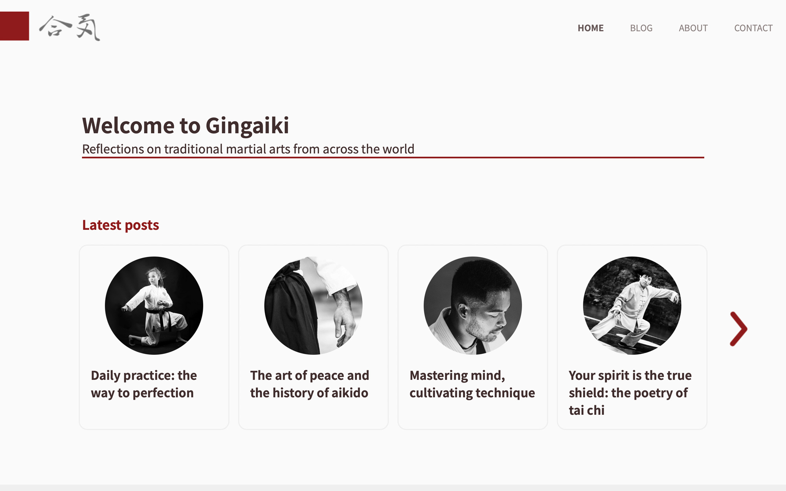

# Gingaiki

[Link to the website deployed via Netlify](https://heartfelt-pegasus-4adc58.netlify.app/index.html)

Short intro

## Description

xxxxxxx

- xxxxxxx
- xxxxxx
- xxxxxxx

## Built with

- Adobe XD
- HTML
- CSS
- Javascript
- Wordpress REST API
  - Plugin: xxxx
  - Plugin: xxxxx
  - Plugin: xxxxxx
- Hotjar

## Links

<!-- - [Mid-fidelity web prototype](https://xd.adobe.com/view/b08399c0-a725-4348-ac92-9de243d70591-e5d0/);
- [Low-fidelity mobile prototype](https://xd.adobe.com/view/5ea1f10f-8843-4eb2-893d-083f197a63ee-0bf2/);
- [Gantt chart](https://app.instagantt.com/shared/61be4727d4b9055cb29e34dd);
- [Full report](https://shared-assets.adobe.com/link/e01001d4-0f56-4825-7ed8-391135a7e4d7). -->

## Grade & Feedback from instructor

Not graded yet.

<!-- **Grade:** X

**Appealing design:** 2,75 / 3

_Comment: The site looks great. Fonts and colors well chosen. Easy to navigate site. Ideally, projects are delivered as though they’re ready to go live for a client._

**Technically efficient:** 4 / 4

*\_*Comment: HTML is neat, bug-free and semantic. CSS is organised and follows DRY principles. No issues on the technical side.\*

**WCAG guidelines, content management and SEO:** 2 / 2

*\_*Comment: The blue text on the blue background is AA but not AAA compliant. Good if you can get AAA compliance but no points deduction.\*

**Report:** 1 / 1

_Comment: Well thought through report. Nice to read the student’s holistic thinking including topics like ED&I Very little to fault in the project._

### Marking Criteria

- Can apply vocational knowledge to practical problems in web development with emphasis on design process, aesthetics and the use of HTML and CSS;
- Can apply vocational knowledge to practical problems in web development with emphasis on design process, aesthetics and the use of HTML and CSS;
- Masters industry-relevant tools, techniques and expressions in design process and development of websites in accordance with regulations and guidelines for universal design;
- Can study and document his/her own work processes and identify design related issues and what measures needs to be implemented. -->

## Contributing

Feel free to suggest improvements and open a pull request if you want to get involved in this project.

## License

- Copyright (c) 2022 Henri Kugler
- [MIT License](/LICENSE)

## Contact

- [My LinkedIn page](https://www.linkedin.com/in/henri-kugler-78218422b/)
- My personal portfolio (under construction)

## Acknowledgments

This project uses copyrighted images of my own authorship as well as royalty-free images from [Unsplash](https://unsplash.com).
